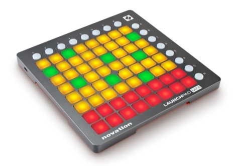

LP4J - A Launchpad API for Java !
====

[](https://travis-ci.org/OlivierCroisier/LP4J)

Launchpad is a midi device built by Novation, used to drive computer-assisted music creation applications such as Ableton Live.

The device is a square board with a 8x8 pads grid, surrounded by round command buttons. Pads and buttons can be lit in various tints of yellow, red and green.
This makes the Launchpad an interesting general-purpose I/O device, where a user can press pads and buttons to send commands to an application, and provide feedback with its 8x8 matrix of colored leds.



LP4J is a lightweight Java API allowing any Java application to interact with a Launchpad S (second generation).
It also provides a embedded, web-based emulator to allow developers to design and test applications should they not have access to a physical device.

The API is split in 3 submodules :
- lp4j-api : an abstract, high-level API defining how to interact with a Launchpad (LaunchpadClient / LaunchpadListener)
- lp4j-midi : a MIDI implementation of the API, suitable to interact with a physical device.
- lp4j-emulator : a web-based emulator, using SVG and websockets.

How to use LP4J
====

From a developper's perspective, all interaction with LP4J are done through the high-level API.

First, you need to get a reference to a Launchpad :

```java
    // Physical device (with auto-detected ports configuration)
    Launchpad launchpad = new MidiLaunchpad(MidiDeviceConfiguration.autodetect());

    // Or start the emulator on http://localhost:9000
    Launchpad launchpad = new EmulatorLaunchpad(9000);
```

From this Launchpad instance, you can :
- retrieve a LaunchpadClient, used to send commands TO the device or emulator (mostly to turn on/off the pads or buttons lights),
- set up a LaunchpadListener to react to events.

```java
     LaunchpadClient client = launchpad.getClient();
     launchpad.setListener(new MyListener());
```

A very simple debugging listener can look like this :

```java
    public static class MyListener extends LaunchpadListenerAdapter {

        @Override
        public void onPadPressed(Pad pad, long timestamp) {
            System.out.println("Pad pressed : "+pad);
        }

    }
```

A more complex example
====

Listeners can be more complex.
For example, the following Listener sends commands back to the Launchpad to put a yellow light under pads when they are pressed, lighting them off when they are released.

Please also note the use of a CountDownLatch to wait for the user to press the "STOP" button before exiting the application.

```java
public class Example {

    private static CountDownLatch stop = new CountDownLatch(1);

    public static void main(String[] args) throws Exception {

        Launchpad launchpad = new EmulatorLaunchpad(9000);
        LaunchpadClient client = launchpad.getClient();

        MyListener myListener = new MyListener(client);
        launchpad.setListener(myListener);

        // Set a red light under the STOP button
        client.reset();
        client.setButtonLight(Button.STOP, Color.RED, BackBufferOperation.NONE);

        stop.await();
        client.reset();
        launchpad.close();
    }

    public static class MyListener extends LaunchpadListenerAdapter {

        private final LaunchpadClient client;

        public MyListener(LaunchpadClient client) {
            this.client = client;
        }

        @Override
        public void onPadPressed(Pad pad, long timestamp) {
            client.setPadLight(pad, Color.YELLOW, BackBufferOperation.NONE);
        }

        @Override
        public void onPadReleased(Pad pad, long timestamp) {
            client.setPadLight(pad, Color.BLACK, BackBufferOperation.NONE);
        }

        @Override
        public void onButtonReleased(Button button, long timestamp) {
            client.setButtonLight(button, Color.BLACK, BackBufferOperation.NONE);
            switch (button) {
                case STOP:
                    stop.countDown();
                    break;
            }
        }
    }

}
```
